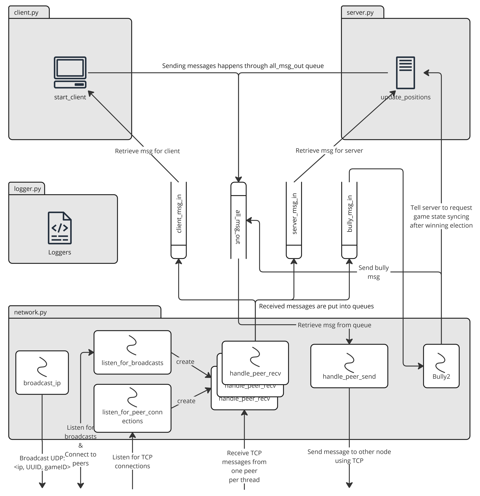

# Distributed-project-24

A project for Distributed Systems 2024. This project implements a multiplayer peer-to-peer game with Pygame where a host is dynamically chosen to function as the server.

The only required dependency is pygame, which means the client can be started with:

```bash
pip install pygame
python client.py
```

The client begins by listerning for UDP broadcasts on all interfaces and by listening for peer connections on a TCP socket. These two ways are used to establish connections to new peers. The client will respond to broadcasts by establishing a connection to the sending peer, but only if their ID is larger than the host's ID. In the opposite case, the connection will be established when the lower ID peer initiates the connection.

Simultanouesly, the client also starts broadcasting its own UUID to any possible peers on the local network. Each client generates a UUID for itself using Python's `uuid` module. The UUID is used by the bully leader negotiation process. Upon receiving a connection from another peer, the client requests the peer's UUID.

The broadcast socket, peer connection listener, and any peer connections bind to a specific IP address that is acquired based on where the default gateway of the host routes the connection. This will in most cases acquire a socket to the local network. If necessary, it is possible to launch the game with the environment variable GAME_IP set to a specific IP address to instead set the IP manually. For example it might be useful to set GAME_IP=127.0.0.55 to match with peers running on the loopback interface for local testing.

After a short peer discovery period, the client starts running the bully algorithm by sending itself a bully `ELECTION` message. This procedure is also re-executed if the current server crashes later.

- Upon receiving an `ELECTION` message, the client responds with an `OK` if the sender's node is smaller than the client's node, and regardless of the ID it sends an `ELECTION` message to all peers that have a higher ID.
- Upon receiving an `OK` message, the client starts waiting for a `COORDINATOR` message as the `OK` means there is a higher ID node.
- Upon receiving a `COORDINATOR` message, the client starts treating the sender as a server host.
- If the client doesn't receive an `OK` message or a `COORDINATOR` message after waiting, it times out and either sets itself as the coordinator, if it was still waiting for an `OK`, or starts a new election, if it was waiting for a `COORDINATOR` message.

The application's TCP messaging uses a simple protocol, which attaches a length header to each sent message to indicate when the message ends. This is used for both the bully algorithm and the client-server game communication. The game server communication uses JSON. The client, bully algorithm, and the server threads do not themselves send/receive data but read data from their respective incoming message queues. Incoming messages are put to the queue by separate threads each handling one connection to a peer. Similarly, outgoing messages are put into an outgoing message queue, where a separate sender thread reads them and sends them to the recipient.

The JSON objects sent by the server may contain the following keys:

- `sync_gamestate`, which contains the server's logical clock and asks for clients to relay any possible newer game states to the server. This would be the only value sent in the message when the server host changes.
- `clock`, containing the server's current logical clock value.
- `players`, containing the player positions.
- `gatherables`, containing the goal object positions.
- `scoreboard`, containing the player scores.

On every server tick, the server will send the `clock`, and `players` values, but the `gatherables` and `scoreboard` values are only set when they are updated. The client communicates back to the server by sending movement directions with JSON, and may also relay the full game state back as an answer to `sync_gamestate`.

State is shared between the client and server, as movement commands only point out the direction the player is moving towards. Synchronization and consistency are enabled via logical clocks, which are used for deciding what the newest game state is. There is no explicit need for a consensus as the server host handles all game logic, but when it crashes, the logical clock helps restore the correct game state. Node discovery is implemented via broadcasting in the local network, which is used to gather the list for appointing a leader. The game has fault tolerance in the form of choosing a new leader whenever the current server host crashes. There is no specific mechanism in the current implementation for improved scalability as only one node can act as the server at a time, and it doesn't make sense for a single game to have too many players due to game board size.

## Overall structure of the code

The project consists of 4 different modules, 

- `client.py` contains client code related to rendering the screen, reading player inputs, and starting the game's other services like networking threads and the server thread. Communication with the server happens through the `client_msg_in` and `all_msg_out` Python Queues imported from the `network.py` module. The client functionality is handled by a thread running the game loop in the `start_client` function.
- `server.py` contains server code that handles player commands per tick, checks that the commands do not take the player outside the bounds of the board, and updates scores when a player managed to grab a gatherable. The server also spawns new gatherables to the game board as needed. Similarly to the client-side, the `server_msg_in` is used for incoming messages from clients and `all_msg_out` queue is used for sending updates. The server functionality is handled by another thread running the `update_positions` function. The server and client on the same node do not share data with each other directly, but through the `network.py` module similarly to other clients.
- `network.py` has all network related functionality, and the bully algorithm implementation. Networking is heavily threaded, with separate threads for broadcasting, listening to broadcasts, sending to all peers, listening for new peer connections, individual threads for handling receiving from different peers, and the bully algorithm. Due to the heavily threaded nature of the program, known peers are stored in a Peers object that protects the underlying data structure using a Python RLock.
- `logger.py` is a tiny module for making new Python `logging` module's Logger objects used for printing messages to the console. You can turn off debug mode to get less messages.


